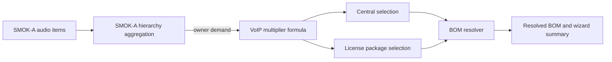

# Slican audio architecture

## Resolution flow

The wizard reads audio items from task metadata (`slicanAudioItems` or
`audioItems`), aggregates them for the audio owner and passes the resulting
`audioBreakdown` to the BOM resolver. The resolver calculates VoIP demand,
selects an active central that satisfies all configured limits, and maps each
license type to configured packages. The wizard displays the recommendation,
warnings and resolved BOM quantities.

## SMOK-A hierarchy and ownership

The supported node kinds are LCS, Nastawnia, Przejazd, SKP and Point. The LCS
owns propagated demand; an independently configured Nastawnia can own its own
demand. The aggregation endpoint receives `{ ownerId, nodes }`; a node belongs
to the requested owner when its `id` or explicit `ownerId` matches that owner.
Each input node is counted once. Item `id` and `deviceId` values are deduplicated
across the submitted hierarchy, with a warning when a device is repeated.

The aggregate contains counts for DPH.IP, Audio.IP, CTS220.IP, IVR and
conference channels. VoIP subscribers are calculated separately as the ceiling
of the three device counts multiplied by the configured DPH.IP, Audio.IP and
CTS220.IP factors.

## Data model

* `slican_central_specifications` associates a central specification with one
  existing `warehouse_stock` row. It stores the model, five required limits,
  optional vendor limits, selection priority and active status.
* `slican_license_specifications` associates a license SKU with a license type,
  package size (1, 10 or 100), demand field, priority and active status.
* `slican_voip_subscriber_formula` stores the global VoIP multipliers as a
  singleton row.
* The wizard persists its resolved audio breakdown, recommendation, licenses
  and BOM quantities in task metadata; the audio configuration does not create
  or rename warehouse products.

## Cameras and recorders

Audio demand is an explicit `audioBreakdown`, separate from camera counts and
`cameraBreakdown`. It is resolved only for SMOKIP_A LCS or standalone Nastawnia.
SMOKIP_B and CCTV do not resolve Slican audio. Existing camera, recorder and
disk selection remains independent.

## Authorization

Configuration CRUD and the formula API use BOM permissions: GET requires
`bom:read`, POST requires `bom:create`, PUT requires `bom:update`, and DELETE
requires `bom:delete`. Audio resolution and hierarchy aggregation require
`bom:read`. All endpoints also require authentication.

## Operational constraints

An active central must have verified limits before it is used. The five
selection limits are SIP/VoIP subscribers, DPH.IP, Audio.IP, IVR and conference
channels; optional catalog limits are recorded but do not currently participate
in selection. Incomplete or ambiguous license configuration produces a warning
in the audio resolver. A selected stock item must also exist in the applicable
BOM template to be inserted into the resolved template items.

See [API documentation](../api/slican-audio-api.md), the
[administrator guide](../admin/slican-audio-admin.md) and the
[wizard guide](../user/smoka-audio-wizard.md).
