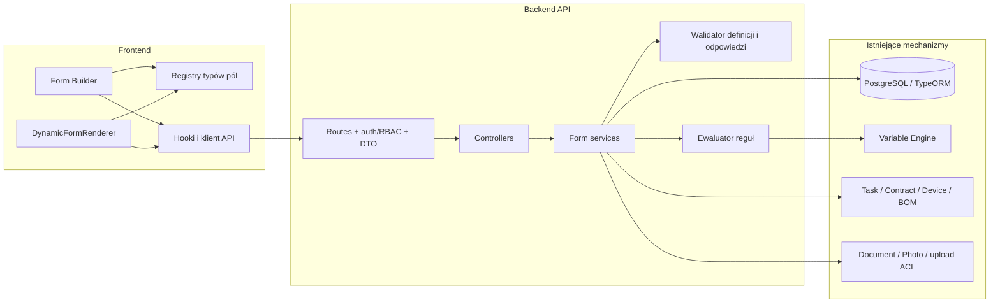
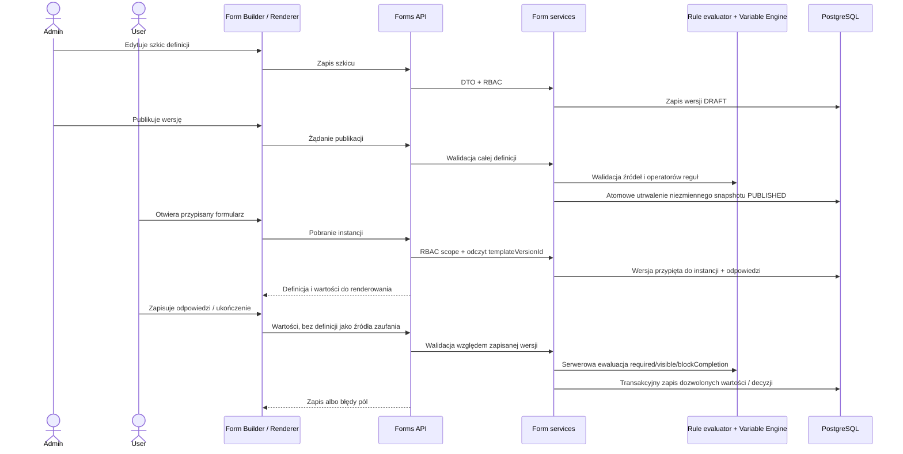

# Form & Checklist Engine — propozycja architektury

**Etap:** 2 dla #687, podrzędny do #685  
**Data:** 2026-10-02  
**Zakres:** propozycja architektury; bez kodu produkcyjnego, migracji i encji.

**Aktualizacja etapu 3 (#688):** wdrożone decyzje modelowe i sposób uruchomienia migracji opisuje sekcja 14. W zakresie reprezentacji definicji zastępuje ona pierwotną propozycję snapshotu JSONB z sekcji 8.

## 1. Założenia i decyzje

Form Engine jest częścią domeny Grovera. Formularz i checklista korzystają z tego samego modelu; `CHECKLIST` jest typem formularza, a nie odrębnym silnikiem. Definicja jest konfigurowana danymi, a nie hardcodowana w komponentach biznesowych.

Proponuję zachować istniejące konwencje: TypeORM/PostgreSQL, Express Router → middleware → controller → service, DTO z `class-validator` oraz istniejące uwierzytelnianie i middleware uprawnień. Nowe elementy mają używać aktualnych bibliotek i wzorców; etap nie dodaje zależności ani nie przesądza o zmianie biblioteki formularzy.

Rozdzielenie odpowiedzialności:

- **definicja** opisuje pola, sekcje, walidację i ograniczone reguły;
- **wersja** jest snapshotem definicji i po publikacji nie podlega edycji;
- **instancja** wiąże wykonanie z konkretną wersją i kontekstem domenowym;
- **odpowiedzi** są zapisywane osobno i walidowane po stronie serwera;
- **Task, statusy domenowe, RBAC, załączniki i Variable Engine** pozostają własnością istniejących mechanizmów.

## 2. Backend

Proponowany podział zgodny z obecnym układem `backend/src`:

| Obszar | Proponowane elementy | Odpowiedzialność |
|---|---|---|
| `entities/` | `FormTemplate`, `FormTemplateVersion`, `FormInstance`, `FormFieldValue`, `FormApproval`, `FormAttachment` | Tożsamość szablonu, snapshot, wykonanie, odpowiedzi, decyzje i referencje do istniejących plików. |
| `services/` | `FormTemplateService`, `FormInstanceService`, `FormApprovalService` | Transakcje, publikacja, przypięcie wersji, dostęp do kontekstu i zapis odpowiedzi. |
| `controllers/` | `FormTemplateController`, `FormInstanceController` | Mapowanie żądań na usługi i odpowiedzi API; bez reguł domenowych. |
| `routes/` | `forms.routes.ts` (lub osobne trasy szablonów i instancji) | Rejestracja tras z `authenticate`, właściwym `checkPermission` i `validateDto`. |
| `dto/forms/` | DTO definicji, publikacji, instancji, odpowiedzi i zatwierdzenia | Jawny kształt wejścia; nie przyjmować schematu walidacji jako źródła prawdy z klienta. |
| `modules/forms/rules/` | walidator definicji, ewaluator warunków, walidator odpowiedzi | Ograniczone, deterministyczne reguły i walidacja względem snapshotu. |

Encje TypeORM należy jawnie rejestrować w `backend/src/config/database.ts`, zgodnie z aktualnym mechanizmem repozytorium. Trasy pozostają podpinane przez istniejący router API. Walidację wejścia należy wykonywać przez istniejące `validateDto` / `class-validator`, a reguł definicji nie sprowadzać do walidacji DTO: wymagają odrębnej walidacji domenowej podczas zapisu i publikacji.

### Odpowiedzialności usług

- `FormTemplateService`: tworzenie i edycja szkicu, walidacja definicji, utworzenie nowej wersji jako kopii i atomowa publikacja.
- `FormInstanceService`: utworzenie instancji z opublikowanej wersji, kontrola RBAC i zakresu rekordu, zapis draftu, walidacja i ukończenie.
- `FormApprovalService`: decyzja i komentarz w kontekście instancji, bez utożsamiania zatwierdzenia formularza ze statusem Task.
- Ewaluator reguł: czysta, testowalna funkcja bez dostępu do bazy, kodu wykonywalnego ani efektów ubocznych.

## 3. Frontend

Umieścić funkcjonalność w `frontend/src/components/forms/`, API w istniejącej warstwie API, hooki w `frontend/src/hooks/`, a typy w `frontend/src/types/`.

- **Form Builder**: edycja metadanych, sekcji, pól i reguł; `@dnd-kit` do zmiany kolejności. Publikacja jest osobną akcją z podglądem błędów walidacji.
- **DynamicFormRenderer**: renderuje tylko definicje pobrane z API, bez komponentów konkretnego formularza biznesowego.
- **Registry per field type**: mapuje zamknięty, jawny typ pola (np. tekst, liczba, data, wybór, checkbox, załącznik) na komponent UI i kontrakt propsów. Nie wybiera komponentu na podstawie dowolnego stringa z definicji.
- **Hooki API**: osobne hooki do listy/pobrania wersji, tworzenia szkicu, publikacji, pobrania instancji, zapisu odpowiedzi i zatwierdzenia; wykorzystują istniejącego klienta HTTP i obsługę błędów.
- **Typy**: wspólne typy payloadów i unia typów pól/reguł w `types/forms.ts`; serwerowe typy nie zastępują walidacji runtime.

Komponenty używają zmiennych CSS Grover/Huskey. UI może wstępnie ukrywać lub oznaczać pola na podstawie reguł, ale wynik backendu jest rozstrzygający. W repozytorium nie ma bezpośrednich zależności frontendowych `react-hook-form` ani `zod` (mimo obecności `zod` w lockfile); przed ich dodaniem należy ocenić istniejące wzorce i ponownie sprawdzić pakiety.

## 4. Wersjonowanie i cykl życia

1. `FormTemplate` jest stabilną tożsamością szablonu (`key`, nazwa, typ `FORM`/`CHECKLIST`, status i autorstwo), nie przechowuje zmiennej definicji używanej przez historyczne wykonania.
2. `FormTemplateVersion` zawiera numer wersji, stan `DRAFT`/`PUBLISHED`/ewentualnie `RETIRED`, pełny snapshot definicji, autora oraz czasy utworzenia i publikacji.
3. Edytować można wyłącznie szkic. Publikacja waliduje całą definicję i utrwala snapshot atomowo. Opublikowany snapshot jest niezmienny w warstwie usług; poprawka lub zmiana tworzy nową wersję jako kopię poprzedniej.
4. `FormInstance` zapisuje niezmienne `templateVersionId` i niezbędny kontekst domenowy. Nie wskazuje „bieżącej wersji” szablonu.
5. Instancja w toku pozostaje przy wersji, z którą została utworzona. Zmiana wersji nie migruje automatycznie odpowiedzi ani nie zmienia znaczenia historycznego wykonania.
6. Wersję wycofaną można wyłączyć z nowych przypisań, ale zachować do odczytu i walidacji istniejących instancji.

## 5. Integracje domenowe

| Obszar | Integracja |
|---|---|
| **Task / SubsystemTask** | Task pozostaje istniejącym nośnikiem pracy, przypisania i kontekstu wykonania. Formularz nie kopiuje ani nie zastępuje hierarchii `Task` / `SubsystemTask` ani ich statusów. Reguły dostępu do instancji uwzględniają kontekst i przypisanie, nie wyłącznie rolę. |
| **Contract / Subsystem / Asset** | Instancja przechowuje referencję do właściwego kontekstu umowy, podsystemu lub obiektu, zgodnie z uzgodnionym przypadkiem użycia. Wartości kontekstu pobiera backend z autoryzowanego rekordu, nie z dowolnego payloadu przeglądarki. |
| **Device** | Formularze mogą dokumentować prekonfigurację lub instalację urządzenia, ale nie zmieniają samodzielnie statusu urządzenia ani relacji fizycznej instalacji. |
| **BOM** | BOM może być źródłem pozycji/identyfikatorów i kryterium utworzenia przypisania. Snapshot formularza nie jest kopią BOM ani nowym mechanizmem jego rozwiązywania. |
| **Trigger** | `BomTrigger` jest specyficzny dla BOM. Nie rozszerzać go wprost na ogólny workflow. W etapie integracji zdarzenia formularza należy podpiąć przez jawne punkty usług domenowych, z ograniczonymi akcjami i idempotencją. |
| **Variable Engine** | Wykorzystywać istniejący parser/resolver/registry do dozwolonych wartości kontekstu i prezentacji `${...}`. Ograniczyć namespace’y i funkcje do jawnej allowlisty; renderowanie zmiennej nie nadaje regule uprawnienia ani nie wykonuje kodu. |
| **Załączniki** | Wartości plikowe wskazują na istniejący `Document`/`Photo` przez `FormAttachment` i klucz pola. Treść pliku pozostaje w istniejącym upload/storage/ACL; pobranie wymaga autoryzacji do instancji. |
| **RBAC / Audit** | Użyć `authenticate`, `checkPermission` i istniejącego modelu `Role.permissions`. Dodać uprawnienia administracyjne szablonów i operacyjne instancji/akceptacji do istniejącego mechanizmu, bez alternatywnego auth. Zaprojektować jawny audyt formularza; nie zakładać istnienia generycznego `AuditLog`. |

### PRECONFIGURATION ≠ ASSEMBLY

Ten sam silnik obsługuje trzy różne procedury, rozróżnione typem/procesem zadania i kontekstem, a nie osobnymi silnikami:

1. **CABINET PREFABRICATION** — prefabrykacja szafy, okablowanie, pomiary i QC.
2. **DEVICE PRECONFIGURATION** — firmware, hostname, IP/VLAN, backup konfiguracji i test przed wysyłką; urządzenie jest samodzielne i nie jest jeszcze fizycznie zamontowane.
3. **FIELD INSTALLATION** — identyfikacja urządzenia, montaż w docelowej lokalizacji, podłączenia oraz weryfikacja po instalacji.

Prekonfiguracja i prefabrykacja prowadzą oddzielnie do gotowości instalacji terenowej. `Device Instance → installedIn → Cabinet Instance / Object / Location` może powstać wyłącznie w obsłudze **FIELD INSTALLATION** po weryfikacji kontekstu. Zapis odpowiedzi, trigger, reguła formularza ani `DEVICE PRECONFIGURATION` nie mogą tworzyć ani modyfikować tej relacji. Instalacja terenowa potwierdza wcześniej wykonaną prekonfigurację; nie powiela jej.

## 6. Bezpieczeństwo i walidacja

- Przy każdym zapisie i ukończeniu backend pobiera wersję wskazaną przez instancję i waliduje wartości względem jej snapshotu. Nie ufa schematowi, typom pól, widoczności ani statusowi przesłanym przez frontend.
- Akceptuje wyłącznie znane klucze pól; weryfikuje typ, format, długość, zakres, liczbę/rozmiar wartości i referencje do plików. Wartości pól niewidocznych lub niedozwolonych przez zapisaną definicję nie mogą obejść warunku przez ręczne żądanie API.
- Warunki wymagane, widoczność i możliwość ukończenia przelicza serwerowo. RBAC sprawdza zarówno uprawnienie do akcji, jak i zakres konkretnej instancji/kontekstu. Interfejs nie jest granicą bezpieczeństwa.
- Definicja i reguły przechodzą walidację strukturalną przy zapisie, a pełną walidację semantyczną przy publikacji. Ograniczyć typy pól, operatory, rozmiar/depth JSON i zbiór zmiennych/funkcji.
- Reguły są danymi deklaratywnymi. Bezwzględnie nie używać `eval()`, `Function()`, dynamicznego importu ani wykonywalnego JavaScriptu/SQL z definicji.
- Sprawdzać własność/ACL załącznika również przy pobieraniu. Nie logować wrażliwych odpowiedzi ani całego payloadu.
- Publikację, utworzenie instancji i finalizację odpowiedzi wykonywać transakcyjnie tam, gdzie operacja obejmuje kilka rekordów; ograniczyć duplikaty zdarzeń przez idempotentny klucz operacji.

## 7. Reguły deklaratywne

Zakres powinien pozostać mały i deterministyczny — nie projektujemy DSL ani workflow engine. Reguła to typowany rekord danych: źródło (`field` o stabilnym kluczu albo dozwolona zmienna kontekstu), operator z allowlisty, operand statyczny/typowany oraz wynik/efekt ograniczony do `visible`, `required` lub `blockCompletion`. Nie obsługujemy kodu, rekurencji, dowolnych funkcji ani łańcuchów warunków nieograniczonej głębokości.

- Odwołanie do odpowiedzi czyta wartość pola bieżącej instancji.
- Odwołanie do kontekstu rozwiązuje backend przez dozwolony Variable Engine; frontend może użyć tego samego opublikowanego opisu do prezentacji, lecz nie autoryzuje ani nie zatwierdza wyniku.
- Ewaluator ma jawne operatory i wartości typowane, ograniczone limity i przewidywalną obsługę braku wartości. Definicja jest sprawdzana przy publikacji.
- `required` obowiązuje warunkowo po stronie serwera. `blockCompletion` opisuje jawny warunek niespełnienia, a backend zwraca identyfikatory pól i błędy potrzebne do poprawy formularza.
- Kiedy odpowiedź się zmienia, zależne warunki są ponownie liczone przed zapisem/finalizacją; ukryte pole nie może zostać uznane za kompletne przez klienta.

## 8. JSONB czy relacyjnie

| Element | Wybór | Uzasadnienie |
|---|---|---|
| Tożsamość szablonu, typ, właściciel/status | Relacyjnie | Stabilne wyszukiwanie, indeksowanie, unikalność klucza i autoryzacja. |
| Numer, status, autor i czas publikacji wersji | Relacyjnie | Wersjonowanie, audyt publikacji i jednoznaczne przypinanie instancji. |
| Pełna definicja wersji: sekcje, pola, walidacja, reguły i opcje | JSONB snapshot | Atomowy, odtwarzalny i niezmienny dokument wersji; unika kaskadowych rekordów definicji i częściowych zmian. Należy walidować schemat i ograniczać rozmiar. |
| Instancja, `templateVersionId`, status, wykonawca i kontekst | Relacyjnie | Filtry, indeksy, relacje do kontekstu, listy zadań i kontrole dostępu. |
| Wartości odpowiedzi | Relacyjny wiersz per instancja/pole + kolumna JSONB typowanej wartości | Indeksowanie klucza pola i historii/autorów; JSONB zachowuje typ liczba/boolean/lista/obiekt bez mnożenia kolumn per typ. Walidacja względem snapshotu. |
| Decyzje zatwierdzeń i audytu | Relacyjnie, append-only | Kolejność, autor, czas, filtrowanie i historia niezmienna. |
| Konfiguracja załącznika | Relacyjny klucz obcy/powiązanie do istniejącego pliku + `fieldKey` | Zachowuje istniejące storage i ACL; nie zapisuje binariów w JSONB. |
| Zmienny kontekstowy payload zewnętrzny | Nie kopiować domyślnie; wybrane metadane JSONB | Unika niespójnej kopii Task/Contract/Device. Snapshot kontekstu tylko dla jawnego wymagania audytowego i po analizie retencji. |

Snapshot JSONB oznacza, że sekcje/pola nie wymagają osobnych tabel w pierwszej wersji. Jeśli raportowanie po definicjach, edycja współbieżna lub rozmiar snapshotu uzasadnią normalizację, można ją rozważyć później bez zmieniania zasady niezmienności opublikowanej wersji.

## 9. Wydajność

- Pobierać wersję i jej snapshot jednym zapytaniem; nie ładować sekcji/pól relacjami, które generują N+1.
- Odpowiedzi, zatwierdzenia i historię pobierać selektywnie; agregować/pobierać wartości partiami zamiast wykonywać osobne zapytanie dla każdego pola.
- Zastosować indeksy do `templateVersionId`, statusu instancji, kluczy kontekstu i pary instancja/pole; dobrać indeksy po profilowaniu zapytań.
- Opublikowane wersje są niemutowalne, więc cache wersji indeksowany niezmiennym `versionId` może być bezpieczny, ale należy go dodać dopiero po pomiarze i z limitem pamięci. Nie używać cache do odpowiedzi, RBAC ani danych wrażliwych. Istniejący cache Variable Engine nie jest automatycznie cachem formularzy.
- Nie przesyłać całej historii i plików z definicją. Odpowiedzi i audyt pobierać stronicowane; pliki obsługuje istniejący kanał załączników. Ustalić limit rozmiaru definicji i pojedynczego zapisu.

## 10. Elementy do dodania i reuse

**Do dodania etapami:** wersjonowane definicje i snapshot publikacji; encje instancji, wartości, zatwierdzeń i powiązań plików; serwisy oraz trasy/DTO; walidator definicji i odpowiedzi; ograniczony ewaluator reguł; administracyjny Form Builder; registry typów pól; DynamicFormRenderer, hooki i typy; uprawnienia formularzy oraz jawny audyt; testy i przykładowy template.

**Do ponownego użycia:** TypeORM, PostgreSQL i centralna rejestracja encji; Express, istniejący układ routes/controllers/services, `class-validator`, `authenticate`, `checkPermission`; `Task`, `SubsystemTask`, `Contract`, `Subsystem`, `Asset`, `Device`, BOM i ich przypisania jako kontekst (bez zastępowania istniejących modeli); `ActivityTemplate` / `TaskActivity` jako wzorzec checklisty, nie uniwersalna definicja; `Document`/`Photo` i istniejący upload/ACL; Variable Engine `${...}` w zakresie dozwolonych zmiennych; `@dnd-kit`, istniejący klient API, UI i zmienne CSS obu motywów.

## 11. Ryzyka, kompromisy i możliwe błędy

- **Snapshot JSONB kontra raportowanie:** upraszcza wersjonowanie i utrzymanie spójności kosztem trudniejszych zapytań analitycznych po definicji. Najpierw relacyjne rekordy wykonania i odpowiedzi, bez przedwczesnej normalizacji pól.
- **Uogólniony kontekst:** jeden typ/ID jest prosty, ale nie daje klucza obcego. Preferować jawne relacje dla uzgodnionych typów kontekstu; każda elastyczność wymaga serwerowej allowlisty i sprawdzenia dostępu.
- **Nowe uprawnienia:** dopisanie nazw uprawnień bez aktualizacji ról, UI administracyjnego i kontroli rekordów może nieoczekiwanie blokować lub odsłaniać operacje.
- **Niejednoznaczna semantyka reguł:** porównania typów, brak wartości, kolejność warunków i edycja po ukryciu pola muszą być opisane oraz testowane przed wdrożeniem.
- **Trigger i duplikaty:** nieostrożne powiązanie zapisu/odświeżenia z istniejącymi triggerami BOM może wielokrotnie tworzyć instancje lub mieszać odpowiedzialności.
- **Immutability:** aktualizacja opublikowanej wersji albo walidacja historycznej instancji względem najnowszej wersji niszczy traceability.
- **Procesy urządzeń:** utożsamienie prekonfiguracji z montażem, albo utworzenie `installedIn` przed FIELD INSTALLATION, jest błędem domenowym krytycznym dla traceability.
- **Prywatność:** odpowiedzi, zdjęcia i dokumenty mogą zawierać dane wrażliwe; wymagane są scope RBAC, limity, retencja i bezpieczny audyt bez kopiowania pełnych payloadów do logów.
- **Współbieżność i rozmiar:** równoczesny zapis/akceptacja wymaga transakcji lub kontroli konfliktu; zbyt duży JSONB/payload zwiększy koszt API i pamięci.
- **Zbyt szeroki MVP:** nie dodawać BPMN, ogólnego workflow, skryptów ani własnego języka reguł; rozszerzać model tylko na podstawie przypadków użycia.

## 12. Etapy 3–13 i zależności

| Etap | Zakres | Zależności |
|---|---|---|
| **3. Model danych + migracje** | Uzgodnić definicję, wersje, instancje, wartości, kontekst, indeksy i retencję; migracje TypeORM. Każdy nowy plik migracji musi mieć datę utworzenia w nazwie (np. `YYYYMMDD...`). | Etap 2; decyzje domenowe z #685. |
| **4. Backend services** | Usługi szablonów, wersjonowania, instancji oraz walidacja domenowa. | 3. |
| **5. API** | DTO, routes/controllers, RBAC i API do edycji, publikacji, wykonania i odpowiedzi. | 4. |
| **6. Form Builder** | Edycja szkiców, sekcji/pól, podgląd walidacji i publikacja. | 5 (można rozpocząć makietę równolegle po uzgodnieniu kontraktu). |
| **7. DynamicFormRenderer** | Registry pól, renderowanie wersji, stan odpowiedzi i błędy serwera. | Kontrakt API z 5; można rozwijać równolegle z 6. |
| **8. Rules / Trigger integration** | Ograniczony ewaluator, Variable Engine allowlist i punkty integracji zdarzeń. | 4–5; uzgodnione formaty danych i testy reguł. |
| **9. FormInstance + wykonanie** | Tworzenie/przypisanie, drafty, walidacja i ukończenie instancji. | 3–8, szczególnie niezmienność wersji i renderer. |
| **10. Approval + Audit** | Zatwierdzenia i append-only historia decyzji/zmian. | 9; istniejący RBAC. |
| **11. Testy** | Testy kontraktów, snapshotów, reguł, RBAC scope, załączników, współbieżności i granic procesów. Testy dodawać wraz z etapami 3–10, a tu domknąć testy integracyjne. | 3–10. |
| **12. Przykładowy `LPR_INSTALLATION`** | Template demonstracyjny i weryfikacja pełnego przepływu bez hardcodowania go w rendererze. | 9–11. |
| **13. PRECONFIGURATION ≠ ASSEMBLY** | Integracja z procedurami CABINET PREFABRICATION, DEVICE PRECONFIGURATION i FIELD INSTALLATION; `installedIn` wyłącznie na instalacji terenowej. | 3–12; wymaga testów Device/Task i potwierdzonych przejść domenowych. |

## 13. Diagramy

### Moduły



### Publikacja i wykonanie



## 14. Model wdrożony w etapie 3 (#688)

- `FormTemplate` przechowuje stabilny `key`, typ `FORM`/`CHECKLIST`, `procedureType` i flagę `active`. Nie ma odrębnej encji checklisty.
- `FormTemplateVersion` ma unikalną parę `(templateId, version)` z dodatnim numerem, `DRAFT`/`PUBLISHED`, `publishedAt`, autorstwo oraz własne `title`, `description`, `kind`, `procedureType` i JSONB `settings`. Serwis tworzący szkic w etapie 4 powinien skopiować metadane szablonu; późniejsza zmiana szablonu nie zmienia historycznej wersji.
- Zakres #688 wymaga encji `FormSection` i `FormFieldDefinition`, dlatego definicja jest **jednym niezmiennym agregatem relacyjnym**, nie drugą kopią w JSONB. Sekcje, pola, `FormTrigger` i `FormAssignmentRule` należą do konkretnej wersji. Klucze sekcji/pól są unikalne w wersji; kolejność jest indeksowana. Relacje pozwalają pobrać agregat przez jawne joiny lub zapytania zbiorcze, bez eager/lazy loading i kaskadowego zapisu.
- Typ pola jest `varchar`, nie enumem PostgreSQL: dodanie typu nie wymaga migracji. `validation`, `options`, `conditions` oraz ustawienia wersji są JSONB; walidacja strukturalna, allowlisty typów/operatorów i interpretacja tych danych należą do kolejnych etapów. Nie zawierają wykonywalnych skryptów ani akcji modyfikujących instalację urządzenia.
- Constraint wymaga spójności statusu wersji z `publishedAt`. Triggery PostgreSQL blokują `UPDATE`/`DELETE` opublikowanej wersji oraz `INSERT`/`UPDATE`/`DELETE` jej sekcji, pól, triggerów i przypisań, także przenoszenie rekordów między wersjami. Edycja definicji blokuje wiersz wersji (`FOR UPDATE`), aby serializować ją z publikacją. `TRUNCATE` definicji jest zabroniony. Poprawka opublikowanego formularza oznacza nowy szkic, nie cofnięcie publikacji.
- `FormInstance.templateVersionId` jest obowiązkowe, wskazuje wyłącznie opublikowaną wersję i nie może się zmienić. Status wykonania nie zastępuje statusu istniejącego zadania. Wersję można wyłączyć z nowych użyć przez dezaktywację szablonu w przyszłym serwisie; ten etap nie wprowadza mutowalnego stanu `RETIRED` wersji.
- Kontekst instancji używa FK do istniejących `Contract`, `Task`, `SubsystemTask`, `Device`, `User` i `Brigade` (`assignedTeamId`). `objectId` wskazuje `Asset`. `bomItemId` wskazuje `TaskGeneratedBomItem`, a alternatywne `workflowBomItemId` — `WorkflowGeneratedBomItem`; nie można podać obu naraz. Opcjonalność kontekstu pozwala na formularz samodzielny; jego spójność domenową i scope RBAC sprawdzą serwisy.
- `FormFieldValue` ma jedną wartość JSONB na parę `(instanceId, fieldDefinitionId)`. Złożone FK z `templateVersionId` zabraniają użycia pola innej wersji oraz powiązania pola z sekcją lub przypisania z triggerem innej wersji.
- Pliki są referencjami many-to-many z wartości pól do istniejących `Document`/`Photo` przez `form_value_documents` i `form_value_photos`. Nie powstaje nowy storage ani kopia `Attachment`. Istniejące ACL/upload pozostają obowiązkowe w przyszłych serwisach.
- `FormApproval` jest append-only: decyzja, autor, czas, komentarz, `stepKey`, dodatnie `stepOrder` i `round` oraz metadane JSONB pozwalają rozbudować zatwierdzanie o kolejne kroki i ponowne zgłoszenia. Nie ma nowej generycznej tabeli audit ani wykorzystania wyspecjalizowanego `EmailAutomationAuditLog` do obcej domeny; integracja audytu pozostaje etapem 10.
- Wszystkie FK używają `RESTRICT`, aby fizyczne usunięcie kontekstu nie niszczyło traceability ani opublikowanych definicji. Archiwizacja/retencja musi uwzględniać te referencje; istniejące soft-delete nie usuwa rekordów.
- Procedury są ograniczone do `CABINET_PREFABRICATION`, `DEVICE_PRECONFIGURATION`, `FIELD_INSTALLATION`. W modelu formularzy nie ma `installedIn`, kaskadowych aktualizacji `Device` ani triggerów zmieniających `devices.installed_asset_id`. `objectId` jest kontekstem, **nie potwierdzeniem fizycznego montażu**. Tylko przyszła obsługa instalacji terenowej może modyfikować istniejącą relację urządzenia; samo zapisanie formularza prekonfiguracji nie robi tego.

### Migracja i weryfikacja

Migracja TypeORM: `backend/src/migrations/20261002_create_form_checklist_engine.ts`, jawnie zarejestrowana w `AppDataSource`. Nazwa klasy ma 13-cyfrowy timestamp wymagany przez runner TypeORM; nazwa pliku zawiera datę utworzenia. `up` tworzy wyłącznie nowe tabele/indeksy/constrainty/funkcje, a `down` usuwa je w odwrotnej kolejności, bez zmiany istniejących tabel domenowych.

Z katalogu `backend`, przy skonfigurowanej istniejącej bazie:

```bash
npm run migration:run
npm run build
npm test -- --runInBand tests/unit/config/formEngineModel.test.ts
```

`AppDataSource.synchronize` jest wyłączone **we wszystkich środowiskach**, także development. Zmiany schematu wymagają migracji. Istniejący `npm run migrate:all` obsługuje historyczne pliki SQL, nie tę migrację TypeORM.

Testy integracyjne można uruchomić na dedykowanej bazie PostgreSQL, ustawiając `FORM_ENGINE_TEST_DATABASE_URL` i wykonując:

```bash
npm test -- --runInBand tests/integration/form-engine-migration.test.ts
```

Testy tworzą i usuwają wyłącznie własny tymczasowy schemat; w nim minimalne istniejące cele FK oraz rzeczywiste nowe tabele przez runner TypeORM. Sprawdzają publikację, niezmienność całego agregatu, współbieżną edycję/publikację, powiązania między wersjami, odczyt historycznych odpowiedzi przez ORM, referencje plików, wielostopniowe decyzje, rozdzielenie prekonfiguracji od montażu oraz `down`/ponowne `up`. Bez tej zmiennej testy integracyjne są pomijane.

## Źródła analizy

- [Analiza repozytorium — etap 1](01-repository-analysis.md)
- [Issue nadrzędne #685 — zasady domenowe](https://github.com/Crack8502pl/der-mag-platform/issues/685)
- Konwencje kodu wskazane w analizie: `backend/src/config/database.ts`, `backend/src/routes/task.routes.ts`, `backend/src/middleware/validator.ts`, `backend/src/modules/variable-engine/` oraz `frontend/package.json`.
